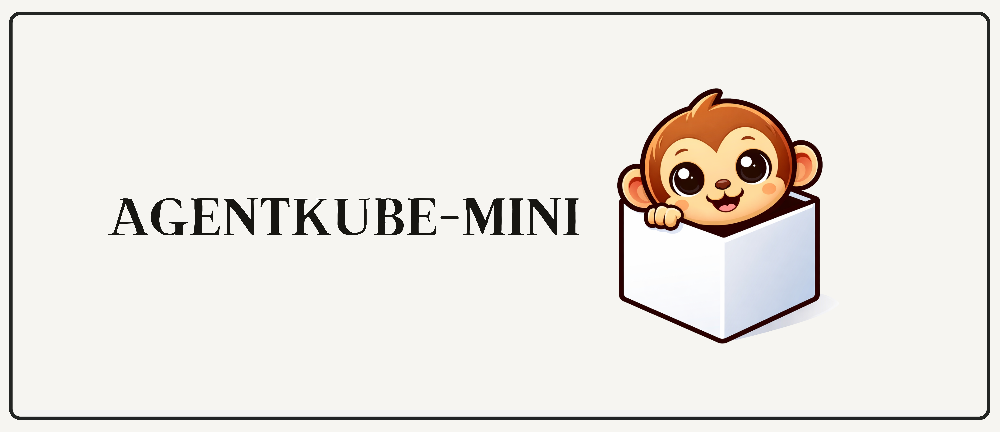

# AgentKube-Mini

<p align="center">
  
</p>

A tiny agent orchestration engine. Implements a task DAG, dependency-aware parallel scheduler, and event system for multi-agent pipelines — all in about 400 lines of Python with zero dependencies. The idea is to show how agent orchestration *actually works* under the hood. 

### Installation

```bash
pip install agentkube-mini
```

### Quick start

### Example usage

Define agents as simple functions, wire them into a DAG, and run:

```python
from agentkube_mini import Agent, TaskGraph, Runtime

# define agents — each is just a name + function
research = Agent("research", lambda topic: f"data about {topic}")
analysis = Agent("analysis", lambda topic, deps: f"analysis of {deps['research']}")
writer   = Agent("writer",   lambda topic, deps: f"article based on {deps['analysis']}")
critic   = Agent("critic",   lambda topic, deps: f"score=9 for {deps['writer']}")

# wire the DAG
graph = TaskGraph()
graph.add(research)
graph.add(analysis, depends=["research"])
graph.add(writer,   depends=["analysis"])
graph.add(critic,   depends=["writer"])

# run it
result = Runtime(graph).run("AI agents")
print(result.outputs)
```

Output:

```
research → data about AI agents
analysis → analysis of data about AI agents
writer   → article based on analysis of data about AI agents
critic   → score=9 for article based on analysis of data about AI agents
```

The scheduler automatically figures out which agents can run in parallel (independent nodes run concurrently via `ThreadPoolExecutor`) and which must wait for dependencies. Events are emitted at each step (`task_started`, `task_completed`, `task_failed`) so you get observability for free.

### Visualization

The task graph can print itself as text or as a Mermaid diagram:

```python
print(graph.visualize())
# research -> analysis
# analysis -> writer
# writer -> critic

print(graph.to_mermaid())
# graph TD
#     research
#     research --> analysis
#     analysis --> writer
#     writer --> critic
```

### Events and shared memory

Every run produces an event log and a shared memory dict that all agents write into:

```python
from agentkube_mini import Runtime, EventBus

bus = EventBus()
bus.subscribe("task_failed", lambda e: print(f"ALERT: {e.task} failed"))

result = Runtime(graph, event_bus=bus).run("AI agents")

# event log
for ev in result.events:
    print(ev.type, ev.task)

# shared memory — every agent's output is accessible
result.memory["research"]  # → "data about AI agents"
```

### Using with existing code

You don't have to rewrite your services. Wrap them with `auto_agent`, which auto-detects the function signature:

```python
from agentkube_mini import auto_agent

# your existing function, unchanged
def my_research_service(topic: str) -> dict:
    return {"topic": topic, "facts": ["f1", "f2"]}

research = auto_agent("research", my_research_service)
```

See `integration_example.py` for a full working example with legacy service classes.

### How it works

The core abstraction is: **agents are nodes, dependencies are edges, the scheduler walks the DAG**. That's the whole idea. If you understand this, you understand the center of every real multi-agent runtime — the rest (distributed workers, retries, message queues, state stores) is extensions on top.

```
Agent graph  →  Scheduler  →  Parallel execution + Events
```

### File structure

```
agent.py               — the Agent dataclass (name + callable)
task_graph.py          — DAG: add nodes, validate, visualize
scheduler.py           — dependency-aware parallel scheduler
runtime.py             — thin wrapper around scheduler
events.py              — event bus with subscribe/emit/history
example.py             — the demo shown above
compat.py              — auto_agent adapter for existing code
smoke_test.py          — tiny correctness test
integration_example.py — legacy service adapter demo
```

### Running tests

```bash
python3 smoke_test.py
```

### License

MIT


